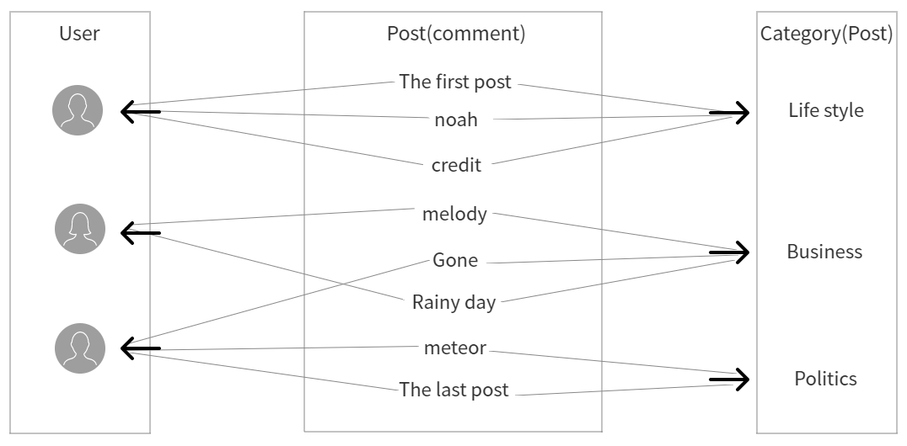
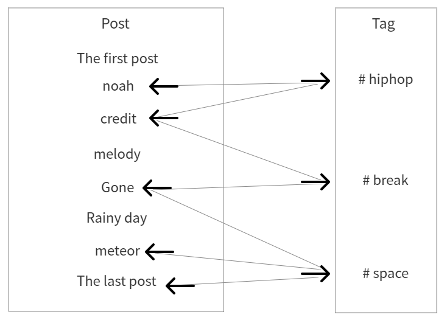

# django_blog

공부하면서 만드는 장고 블로그

목표 기능  
1. 회원가입  
2. 댓글 작성, 수정, 삭제  
3. 게시글 검색  
4. 관리자 권한이 있는 계정은 블로그 작성 가능. 즉, 권한 설정 가능  
5. 복잡한 가입 절차가 필요 없는 소셜 로그인 기능  
6. 인터넷 상에서 접속 가능  
7. 보안을 위해 HTTPS 인증 받음  

- TDD로 진행  

개발하려는 항목에 대한 점검 사항을 테스트 코드로 만들고 그 테스트를 통과시키는 방식으로 개발 진행

> **내가 무엇을 하고 있는지 분명히 정의하고 개발을 시작하기 위해**  

> **종속성과 의존성이 낮은 모듈로 조합된 개발을 위해**  

> **다양한 예외상황에 대해 생각해보고 대처하여 완성도 높은 설계를 위해 TDD 개발 방식을 선택했다.**  

## 웹 페이지  

- Landing page  
- Blog page  
- 자기소개 page  
- Category page(카테고리 클릭 시 카테고리에 해당되는 포스트가 나열된다.)

URL 구조

|페이지|URL|
|---|---|
|Landing page|도메인/|
|블로그 페이지 - 포스트 목록|도메인/blog/|
|블로그 페이지 - 포스트 상세|도메인/blog/포스트pk|
|자기소개 페이지|도메인/about_me|  

### 앱

블로그 기능을 위한 blog 앱, landing page와 자기소개 page를 위한 single_pages 앱으로 구성되어 있다.  

## 모델 구조  

User: 사용자 모델, 장고에서 제공하는 User 모델 사용

Post: 포스트의 형태 정의

Category: 포스트가 해당하는 카테고리 모델

Tag: 포스트에 걸린 태그 모델

Comment: 댓글 모델

- 다대일 관계  

여러 개의 모델이 하나의 모델에 연결되는 관계를 말한다.  

User - Post - Category와 User - Comment - Post가 있다.  



Post 모델은 author를 Foreign key로 두어 User와 연결한다.  

```buildoutcfg
class Post(models.Model):
    author = models.ForeignKey(User, on_delete=models.SET_NULL)
```

- 다대다 관계  

모델이 여러 모델과 연결되는 관계를 말한다.  

Post - Tag가 있다.  



Post 모델에서 tags를 ManyToManyField를 이용하여 Tag 모델과 연결한다.

```buildoutcfg
class Post(models.Model):
    tags = models.ManyToManyField(Tag, null=True, blank=True)
```

## 장고의 작동 구조  

장고로 만든 웹 사이트에서 일어나는 과정을 그린 것  

  

1. 먼저 클라이언트(웹 브라우저)는 일련의 과정을 거쳐 장고 웹페이지가 있는 서버를 찾아간다.  

2. urls.py를 요청해 개발자가 써놓은 내용을 확인한다. urls.py에는 'A URL로 접속했을 때는 B 함수를 실행시킨다'는 내용이 기술되어있다.  

3. urls.py에서 언급하는 함수 또는 클래스는 views.py에서 정의한다.  

4. 장고에서는 자료의 형태를 정의한 클래스를 모델이라고 한다.  

5. models.py에서 정의한 모델에 맞게 DB에서 필요한 데이터를 가져온다.  

6. DB에서 가져온 자료를 템플릿의 빈 칸에 채워서 사용자의 웹 브라우저로 보낸다.  

- MTV 패턴이란  

장고로 만든 웹 사이트는 모델(model)로 자료의 형태를 정의하고, 뷰(view)로 어떤 자료를 어떤 동작으로 보여줄지 정의하고, 템플릿(template)으로 웹페이지에서 출력할 모습을 정의한다. 이러한 작동 구조를 줄여서 MTV 패턴이라고 부른다.  

이렇게 분리하여 웹 사이트 기능을 관리함으로써 백엔드 로직과 프런트엔드 디자인이 뒤죽박죽인 코드가 되어 어디서 무엇을 수정해야 할지 모르는 사태를 방지할 수 있다.  

### Migration  

- 데이터베이스에 적용시켜야 하는 변화에 대한 기록  

예를 들어 댓글 기능이 없던 블로그에 댓글 작성 기능을 추가했다고 하면 DB에 댓글을 저장하기 위한 Table이 필요하다.  

이를 DB에 반영해야 서버를 실행했을 때 웹 사이트에 추가한 댓글 기능을 사용할 수 있다.  

※ 장고를 처음 시작할 때 아무 기능도 만들지 않았는데 적용해야 할 migration이 존재한다.(3.2.9버전 기준으로 18개 존재)  

장고는 새 프로젝트를 생성할 때 DB에 기본적으로 필요한 Table을 미리 마련해두기 때문이다.  

### SQLite3  

장고는 기본적으로 SQLite3를 DB로 사용한다.  

SQLite3의 특징은 파일 하나로 관리하는 DB라는 점인데, MySQL, MongoDB, PostgreSQL 등 다른 DB들은 복잡한 설치 과정을 거쳐야 한다.  

또한 백업을 하기 위해서는 DB에 대한 지식이 추가적으로 더 필요하다.  

하지만 SQLite3는 파일 하나만 관리하면 되고, 백업을 할 때도 파일 하나만 안전한 곳에 복사해두면 된다. 이런 간편함 때문에 장고에서는 SQLite3를 기본 DB로 사용한다.  

- 단점  

SQLite3는 파일 기반의 DB이기 때문에 읽고 쓰기가 빈번하게 일어나는 대형 프로젝트에는 불리하다.  

예를 들어 수천, 수만 명의 사용자가 동시에 몰리는 웹 사이트에는 적합하지 않다. 이럴 경우, 고성능의 다른 DB를 사용해야 한다.  

이 프로젝트에서는 SQLite3를 사용하여 DB를 다루고 배포 전 PostgreSQL로 전환한다.  

- 깃에서 DB를 버전관리 하지 않도록 .gitignore에 등록한다.  

로컬에서 테스트를 진행하며 개발을 진행하고 개발이 끝나면 프로젝트 파일 전체를 깃허브를 통해 옮긴다.  

그런데 db.sqlite3까지 옮기게 되면 테스트 과정에서 만든 정보가 모두 서버로 넘어가게 된다.  

만일 이미 운영 중인 서버에 db.sqlite3가 있다면 로컬에서 온 db.sqlite3와 충돌을 일으킬 것이고, 오류가 발생할 것이다.  

이를 방지하기 위해 db.sqlite3는 깃으로 관리하지 않는다.

### 앱  

장고 프로젝트는 보통 1개 이상의 앱을 가진다. 여기서 앱은 특정 기능을 수행하는 단위 모듈을 의미한다.  

안드로이드 애플리케이션을 의미하는 앱과는 다르다.  

### 모델  

장고의 장점 중 하나는 모델을 이용해 장고 웹 프레임워크 안에서 DB를 관리할 수 있다는 점이다.  

모델은 데이터를 저장하기 위한 하나의 단위이다.  

일반적으로 DB를 다루려면 SQL 등의 언어를 배워야 하는데, 장고의 모델을 이용하면 CRUD 기능을 쉽게 구현할 수 있고 여러가지 폼도 쉽게 만들 수 있다.  

### Admin에 모델 적용 순서  

1. 프로젝트에 있는 settings.py에 INSTALLED_APPS 리스트에 앱 추가  
2. models.py에 원하는 모델 작성  
3. makemigrations, migrate  
4. 앱에 있는 admin.py에 admin.site.register(모델(클래스명))  

장고의 모델을 만들면 기본적으로 pk필드가 만들어진다.  

pk는 각 레코드에 대한 고유값이다. 처음 pk 값은 1이고 1씩 증가한다.  

### urls.py  

사용자가 장고로 개발한 웹 사이트에 방문했을 때 어떤 페이지로 들어가야 하는지 알려준다. 즉, 이정표와 같은 역할을 한다.  

장고 프로젝트 안에 있는 urls.py에 urlpatterns 리스트에 path('url', include('해당 url로 왔을 때 실행할 동작이 명시되어있는 파일명')) 추가해준다.

### views  

urls.py에 들어갈 함수나 클래스 등을 정의한다.  

FBV(Function Based View)는 함수에 기반을 둔 방법이다. 함수를 직접 만들어서 원하는 기능을 직접 구현할 수 있는 장점이 있다.  

CBV(Class Based View)는 장고가 제공하는 클래스를 활용해 구현하는 방법이다. 장고는 웹 개발 시 반복적으로 많이 구현하는 것들을 클래스로 미리 만들어서 제공하는데, 이 클래스들을 이용하는 방법이다.  

- template_name

기본적으로 CBV는 사용하는 template 이름이 정해져있다.

ListView: 모델명_list, DetailView: 모델명_detail, CreateView, UpdateView: 모델명_form 등

다른 템플릿을 사용하려면 template_name 변수에 사용할 템플릿의 경로를 써주면 된다.

```buildoutcfg
template_name = 'blog/post_update_form.html'
```

- get_context_data(self, **kwargs)

CBV로 뷰를 만들 때 템플릿으로 추가 인자를 넘기려면 get_context_data 함수를 이용한다.

딕셔너리에 사용할 key, value를 담아 return하면 템플릿으로 인자가 넘어간다.

```
def get_context_data(self, **kwargs):
    context = super(PostUpdate, self).get_context_data()
    if self.object.tags.exists():
        tags_str_list = []
        for t in self.object.tags.all():
            tags_str_list.append(t.name)
        context['tags_str_default'] = '; '.join(tags_str_list)
            
    return context
```

### 사용한 CBV  

- ListView  

여러 레코드를 목록 형태로 보여줄 때 사용한다.

ListView는 모델명 뒤에 _list.html 이 붙은 html 파일을 기본 템플릿으로 사용한다. 모델명_list.html 파일이 필요하다.  

예를 들어 Post 모델을 사용하면 Post_list.html 파일이 필요하다.  

해당 파일을 만들어도 되고, 해당 클래스에서 template_name을 지정해줘도 된다.  

또한 템플릿에서 ListView로 만든 클래스의 모델 객체를 가져오려면 object_list 명령어를 사용하면 된다. 또는 모델명_list 명령어를 써도 자동으로 인식한다.  

- DetailView  

한 레코드를 자세히 보여줄 때 사용한다.  

모델명 뒤에 _detail.html 이 붙은 html 파일을 기본 템플릿으로 사용한다. 모델명_detail.html 파일이 필요하다.  

예를 들어 Post 모델을 사용하면 Post_detail.html 파일이 필요하다. 

역시 해당 클래스에서 template_name을 지정해줘도 된다.  

또한 템플릿에서 DetailView로 만든 클래스의 모델 객체를 가져오려면 object_detail 명령어를 사용하면 된다. 또는 모델명_detail 명령어를 써도 자동으로 인식한다.  

- ListView와 DetailView 같은 클래스는 기본적으로 get_context_data 메서드를 내장하고 있다.  

ListView를 상속받은 클래스에서 단지 model = 모델 이라고 선언하면 context_data에서 자동으로 모델_list = 모델.objects.all()을 명령한다.  

그래서 템플릿에서 바로 모델_list 변수를 사용할 수 있는 것이다.  

이 context_data 메서드를 오버라이딩 하여 정보를 추가하여 활용할 수 있다.  

```buildoutcfg
Post 모델인 경우  
model = Post # 이 경우 context_data 메서드에서 자동으로 post_list = Post.objects.all() 메서드를 실행한다.
```

```buildoutcfg
get_context_data 오버라이딩 활용 예시

class PostList(ListView):
    model = Post
    
    def get_context_data(self, *, object_list=None, **kwargs):
        context = super(PostList, self).get_context_data() # 기존에 제공했던 기능을 가져와서 context 변수에 저장
        context['categories'] = Category.objects.all()
        context['no_category_post_count'] = Post.objects.filter(category=None).count()
        return context
```


- CreateView

폼을 작성할 때 사용한다.

사용자가 폼에 제대로 내용을 입력하면 form_valid 함수가 실행된다.

form_valid 함수는 방문자가 폼에 담아 보낸 유효한 정보를 사용해 포스트를 만들어 DB에 저장하고, 이 포스트의 고유 경로로 보내주는 역할(redirect)을 한다.

```buildoutcfg
class PostCreate(LoginRequiredMixin, CreateView):
    model = Post
    fields = ['title', 'hook_text', 'content', 'head_image', 'file_upload', 'category']
    
    def form_valid(self, form):
        current_user = self.request.user # 웹 사이트의 방문자 의미
        if current_user.is_authenticated: # 로그인 여부 판단
            form.instance.author = current_user
            return super(PostCreate, self).form_valid(form) # 현재의 form을 CreateView의 기본 form_valid 함수에 인자로 보내 처리한다.
        else:
            return redirect('/blog/') # 로그인을 안 했을 경우 /blog/ 경로로 되돌려보낸다.
```

### dispatch()

dispatch() 메서드는 방문자가 웹 사이트 서버에 GET 방식으로 요청했는지 POST 방식으로 요청했는지 판단하는 기능을 한다.  

CreateView나 UpdateView의 경우 방문자가 서버에 GET 방식으로 들어오면 포스트를 작성할 수 있는 폼 페이지를 보내준다.  

반면 같은 경로로 POST 방식으로 들어오면 폼이 유효한지 확인하고, 문제가 없으면 DB에 내용을 저장한다.  

만일 권한이 없는 사용자가 create나 update를 시도하면 GET이든 POST이든 접근할 수 없도록 해야 한다.

따라서 권한에 따라 접근을 막을 때 dispatch가 실행되는 순간 확인하도록 코드를 작성할 수 있다.  

```buildoutcfg
def dispatch(self, request, *args, **kwargs):
    if request.user.is_authenticated and request.user == self.get_object().author:
        return super(PostUpdate, self).dispatch(request, *args, **kwargs)
    else:
        raise PermissionDenied
```

### template  

데이터를 채워넣고 사용자에게 보여주기 위한 틀이다.  

앱 폴더에 있는 templates 폴더의 html 파일은 정적인 파일이 아니다. templates 폴더에 css, js 파일을 함께 넣어 두어도 해당 파일에 접근할 수 없다.  

css, js 파일은 고정된 내용만 제공하면 되므로 특정 URL로 접근하면 해당 css, js 파일을 제공할 수 있도록 설정한다.  

count() 함수보다 exists() 함수가 서버에 부담을 덜 준다.

템플릿에서 함수를 호출할 때는 괄호를 사용하지 않는다.

### static, 미디어 사용  

css, js 파일은 고정된 내용만 제공하면 되므로 특정 URL로 접근하면 해당 css, js 파일을 제공할 수 있도록 설정한다.  

templates이 있는 곳. 즉, html 파일이 있는 디렉토리에 바로 css, js 파일을 두면 사용할 수 없다.  

templates는 정적이 아닌 동적 파일로 간주하기 때문이다.  

따라서 앱이 디렉토리 하위에 static 디렉토리를 만들어서 css, js 파일을 두고 사용한다.

```
STATIC_URL = '/static/'
```

도메인 뒤에 /static/이라는 경로가 따라오면 static 파일을 사용하겠다는 의미이다.

---

장고는 이미지 업로드를 위한 ImageField를 제공한다.  

ImageField를 사용하기 위해 사용자가 업로드할 이미지를 저장할 위치를 먼저 설정해야 한다.  

settings.py에 

```
MEDIA_URL = '/media/'
MEDIA_ROOT = os.path.join(BASE_DIR, '_media')
```

를 추가한다.  

이미지 파일은 MEDIA_ROOT 설정을 통해 프로젝트 폴더 아래 _media 라는 이름의 폴더를 만들고 그 안에 저장하도록 한다.  

그리고 MEDIA_URL은 /media/로 지정했다. 웹 브라우저에서 도메인 뒤에 /media/라는 경로가 따라오면 미디어 파일을 사용하겠다는 의미이다.  

또한 ImageField를 사용하기 위해서는 Pillow 라이브러리가 필요하다.

```buildoutcfg
pip install Pillow
```

로 Pillow를 가상환경에 설치 후 migration 한다.  

이제 media 가 url에 있을 때 인식시키기 위하여 django_plog_prj/urls.py에 

```buildoutcfg
from django.conf import settings
from django.conf import path, include

urlpatterns += static(settings.MEDIA_URL, document_root=settings.MEDIA_ROOT)
```

를 추가해준다.  

### Template 모듈화  

디자인이 일관되게 유지되어야 편리한 경우가 많다.  

하나의 페이지에 메인 영역을 뺀 나머지 영역을 만들어 놓고 그 부분만 채워주면 편리하게 쓸 수 있다.  

모듈화한 template에 따로 채워넣어야 하는 부분을 아래와 같이 , 으로 감싸준다.  

```buildoutcfg
<div class="container my-3">
    <div class="row">
        <div class="col-md-8 col-lg-9" id="main-area">
            
            
        </div>
    </div>
</div>
```

채워넣을 내용이 있는 html 문서에서는 다음과 같이 을 선언해주고 전달할 내용을 , 으로 감싸준다.  

```buildoutcfg



내용

```

만일 다음과 같이 블록 사이에 값이 들어 있다면, 해당 블록에 해당하는 값이 채워지지 않을 경우 나타나는 기본값임을 의미한다.  

```buildoutcfg

안 채워졌을 경우 나타나는 기본값

```

템플릿을 붙여넣고 싶을 때 원하는 위치에 아래 코드를 입력한다.  

```buildoutcfg

```

### Slug  

SlugField는 사람이 읽을 수 있는 텍스트로 고유 URL을 만들고 싶을 때 주로 사용하는 영어대소문자와 -, _로 이루어진 문자이다.  

페이지의 개수가 많지 않을 때 사용하는 것이 좋다.  

원래 SlugField는 한글을 지원하지 않지만 allow_unicode=True로 설정해 한글로도 만들 수 있게 한다.  

```buildoutcfg
field = models.SlugField(max_length=200, unique=True, allow_unicode=True)
```

### HTML escaping

마크다운 문법으로 작성된 텍스트를 HTML로 변환하여 가져올 때 HTML escaping을 방지하는 필터(safe)를 추가해야 한다.

예를 들어 ```<tag>``` 같이 꺽쇠괄호를 사용한 텍스트를 ```<div>``` 태그 안에 사용한다고 하자.

만일 ```<div><abc></div>```같이 사용한다면 HTML 문법 기준으로는 렌더링하기 모호하다.

```<abc>``` 부분이 ```<abc>```라는 텍스트인지 아니면 ```<abc>```태그인지 판단하기 어렵기 때문이다.

이런 상황을 방지하기 위해 <는 &lt, >는 &gt로 변환한다. 이런 행위를 HTML escaping이라고 한다.

그리고 &lt, &gt같은 요소를 HTML entity라고 한다.

장고는 {{ p.content }}와 같은 방식으로 불러온 값을 템플릿에 렌더링할 때 자동으로 HTML escaping을 한다.

만일 마크다운 문법으로 작성한 내용을 HTML로 바꿔 화면에 그대로 출력하고 싷다면 {{ p.content | safe }}로 HTML escaping을 방지해야 한다.

### Q

장고에서 검색기능을 이용할 때 여러 쿼리를 동시에 사용하는 경우 사용할 수 있는 모듈이다.

django.db.models에서 import 한다.

```buildoutcfg
from django.db.models import Q
```

ListView는 기본적으로 get_queryset() method를 제공한다. 이 메서드는 기본적으로 model로 지정된 요소 전체를 가져온다.

만일 urls.py에서 url에서 받아온 문자가 있을 경우 그 문자는 view.py에서 self.kwargs dictionary에서 가져올 수 있다.

이렇게 urls.py가 설정되어 있으면

```buildoutcfg
path('search/<str:q>/', views.PostSearch.as_view())
```

views.py에서

```buildoutcfg
class PostSearch(PostList):
    def get_queryset(self):
        q = self.kwargs['q']
```

q에 해당하는 부분을 이렇게 사용할 수 있다.

그리고 여러 쿼리를 동시에 사용할 때 아래와 같이 쓸 수 있다.

```buildoutcfg
post_list = Post.objects.filter(
    Q(title__contains=q) | Q(tag__name__contains=q) 
).distinct()
```

먼저 __는 .과 같은 의미이다. 즉, title__contains는 title.contains와 같다. 

쿼리 조건에서 사용할 때는 . 대신 __을 사용한다.

|는 or &는 and를 뜻한다.

distinct()는 두 쿼리 모두에 해당하는 데이터가 있을 경우 해당 데이터를 두 번 가져오는 것이 아니라 한 번만 가져온다.

## 도커

도커는 다른 하드웨어와 운영체제에서 작업하더라도 동일한 환경을 갖출 수 있도록 도와주는 기술이다.

도커 작동 순서

1. 도커의 설정 파일에 OS, python 버전, 라이브러리, 소스 코드, 이미지 파일 등 웹 사이트 배포에 필요한 환경설정 정보 지정

2. 서버 전체를 복제한 컨테이너 이미지 생성

3. 컨테이너 이미지 실행 시 컨테이너가 실행되면서 기존과 동일한 상태로 웹 사이트 서버 실행

```buildoutcfg
# pull official base image
# 도커는 파이썬이 설치되어 있는 이미지를 기본으로 제공한다. 이 이미지를 불러온다.
FROM python:3.8.0-alpine

# set work directory
# 프로젝트의 작업 폴더를 /usr/src/app으로 지정한다.
WORKDIR /usr/src/app

# set environment variables
# 파이썬은 종종 소스 코드를 컴파일해서 확장자가 .pyc인 파일을 생성한다.
# 도커를 이용할 때는 .pyc 파일이 필요하지 않으므로 .pyc 파일을 생성하지 않도록 한다.
ENV PYTHONDONTWRITEBYTECODE 1
# 파이썬 로그가 버퍼링 없이 즉각적으로 출력하게 만든다.
ENV PYTHONUNBUFFERED 1

# requirements.txt에서 살펴본 라이브러리를 설치하기 위해 필요한 gcc, musl-dev 등을 미리 설치한다.
RUN apk update
RUN apk add postgresql-dev gcc python3-dev musl-dev zlib-dev jpeg-dev

# 로컬 커퓨터의 현재 위치(Dockerfile의 위치)에 있는 파일들을 모두 작업 폴더(WORKDIR)로 복사한다.
# 그래야 지금까지 작성한 장고 프로젝트가 도커 이미지에 담긴다.
COPY . /usr/src/app/

# install dependencies
# requirements.txt에 나열된 라이브러리를 설치한다.
RUN pip install --upgrade pip
RUN pip install -r requirements.txt
```

### 도커 컴포즈 파일

도커 컴포즈 파일을 사용하면 컨테이너 여러 개를 한 번에 실행시킬 수 있고, 옵션도 줄 수 있다.

```buildoutcfg
# 도커 컴포즈 파일 포맷을 최신 버전으로 사용하겠다는 의미
version: '3'

services:
  web: # web이라는 이름의 서비스 실행
    build: . # 현재 폴더를 build한다. Dockerfile이 현재 폴더에 있으므로 이 파일을 이용해 컨테이너 이미지를 만든다.
    command: python manage.py runserver 0.0.0.0:8000 # 서버 실행 명령 입력
    volumes: # volumes로 로컬 컴퓨터의 폴더와 도커의 폴더를 연결한다.
      - ./:/usr/src/app/ # 현재 폴더를 /usr/src/app/ 폴더와 연결한다.
      ports: # 8000 포트 사용
        - 8000:8000
env_file: # 오류가 발생했을 시 오류 페이지가 다른 사람에게 보이지 않도록 settings.py에서 관리되던 요소 일부를
  - ./.env.dev # 개발환경(.env.dev)과 배포환경(.env.prod)으로 나누어 관리하려 한다.
  # 아직은 개발 중이므로 개발환경 파일(.env.dev)만 지정한다. 
  # env_file을 따로 명시하면 settings.py에서 이 값을 불러와서 사용할 수 있다.
``` 

