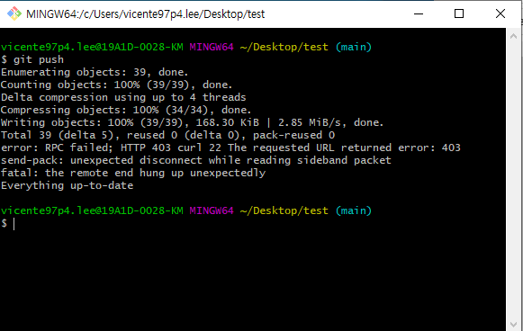

# Git push 문제  

## 2021-11-19  

어느 날처럼 프로젝트를 진행하고 git push를 시도했다.  

그런데 웬걸 이런 에러가 발생하는 것이었다..  

  

아니 어제까지만 해도 잘 되던 깃이 왜 이러나..  

콘솔에 출력된 에러만 보면 알 수가 없으니 일단 구글링을 해보았다.  


```buildoutcfg
error: RPC failed; HTTP 403 curl 22 The requested URL returned error: 403
```

구글링 결과 이 에러는 권한이 없어서 생긴다고 했다.  

해결책으로는 자격 증명 관리자에서 깃허브 부분을 수정하면 된다는 것이었다.  

하지만 역시나 해결되지 않았고 동일한 에러가 발생했다.  

토큰을 재발급 받고 username과 email을 다시 입력해보고 커밋을 날려보고 할 수 있는 모든 초기화를 다 시도했지만 실패했다.  

그래서 다른 에러로 구글링을 해보았다.  

```buildoutcfg
send-pack: unexpected disconnect while reading sideband packet
```

이 에러로 검색해보니 파일의 크기가 커서 에러가 발생했을 수 있다는 것이었다.  

한 번 커밋 당 100MB, 단일 파일 크기는 최대 1MB까지만 푸시가 가능하다는 제약이 있었다.  

그런데 내 장고 프로젝트는 해봤자 60MB 정도였는데.. 단일 파일도 1MB를 넘는게 없는데..  

제약에 위배되지는 않지만 그래도 이것 말고는 해당사항이 없어서 시도해봤다.  

해결방안으로는 아래 명령어를 실행하고 ~/.gitconfig 파일에 설정을 입력하면 된다는 것이었다.

```buildoutcfg
git config --local http.postBuffer = 1048576000
```

```buildoutcfg
[core] 
packedGitLimit = 512m 
packedGitWindowSize = 512m
[pack] 
deltaCacheSize = 2047m
packSizeLimit = 2047m windowMemory = 2047m
windowMemory = 2047m
```

그런데 웬걸 이번에는 
```
postBuffer has numeric '=' value :invalid
```

에러가 발생했다.  

시키는 데로 했는데 안 되는 것만큼 울분이 터지는게 없다.  

미치고 팔짝 뛸 지경이었다. 무언가를 내가 더 꼬아버린 것이다.  

postBuffer가 문제니까 .gitconfig에 있는 postBuffer를 지워봐도 똑같은 에러가 발생했다.  

힘이 다하여 포기할때 쯤 local config와 global config가 다르다는 것을 깨달았다.  

로컬 config를 수정하고 싶으면 아래 명령어로 config 파일을 열면 된다.  

```buildoutcfg
vim .git/config
```

로컬 config 파일을 수정하여 드디어 postBuffer 문제를 해결했다.  

그런데 웬걸.. 여전히 깃 푸시는 실패했고 처음과 같은 에러를 뱉어냈다.  

내가 수정한 config 파일이 적용이 안 된건지.. 뭔지 알 수 없었다.  

그래서 파일을 2개, 3개씩 나눠서 푸시해봤다.  

그런데 웬걸? 또 2개, 3개씩은 푸시가 되는게 아닌가?  

그렇게 푸시하던 도중 원인이 되는 파일을 발견했다.  

원인은 css가 들어있는 static 파일이었다.  

왜인지는 모르겠으나 css 파일이 있으면 깃 푸시가 안 되었다.  

local config 파일에서

```buildoutcfg
[core]
autocrlf=true
```

를 추가해주어도 안 되었다.  

그래서 그냥 static 파일을 .gitignore에 등록하고 그냥 푸시를 안 하기로 했다.  

static 파일은 뭐.. 나중에 따로라도 올리면 되니까..  

그런데 3개월 전에는 css 파일도 잘 올라갔는데 왜 이럴까?  

회사 네트워크 망의 문제일까? 그 사이에 깃허브 정책이 바뀐 것일까?(이건 아닌 것 같다.) 아니면 내가 무언가를 잘못 한 걸까?  

아무튼 깃 때문에 고생했지만 깃의 구조에 대해 조금 배울 수 있었다.